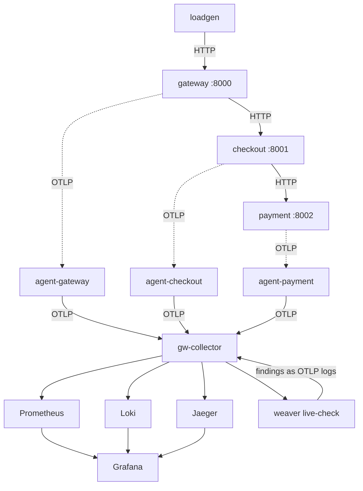

# weaver-bindplane-observability-lab

[](LICENSE)
[](.github/workflows/semconv.yml)
[](.github/workflows/compose-smoke.yml)
[](https://github.com/open-telemetry/weaver)
[](https://github.com/observiq/bindplane-otel-collector)

A small distributed system where the telemetry schema is a real, enforced
contract — not a convention people try to remember.

[**OpenTelemetry Weaver**](https://github.com/open-telemetry/weaver) owns the
schema: it validates it, generates the Python constants the services import,
renders the reference documentation, reports what changed between versions, and
grades the live OTLP stream against it. The [**Bindplane Distro for the
OpenTelemetry Collector**](https://github.com/observiq/bindplane-otel-collector)
owns the transport: a sidecar agent next to every service and a central gateway,
using Bindplane's own processors to mask, enrich, measure, sample and derive
metrics along the way.

Everything runs with `docker compose up`. Nothing needs to be installed except
Docker.

---

## Contents

- [What this demonstrates](#what-this-demonstrates)
- [Architecture](#architecture)
- [Technologies used](#technologies-used)
- [Prerequisites](#prerequisites)
- [Quick start](#quick-start)
- [Project layout](#project-layout)
- [What Weaver does here](#what-weaver-does-here)
- [Try it: change the schema](#try-it-change-the-schema)
- [What the Bindplane collector does here](#what-the-bindplane-collector-does-here)
- [Getting into the Bindplane UI](#getting-into-the-bindplane-ui)
- [The deliberate violation demo](#the-deliberate-violation-demo)
- [Cleaning up](#cleaning-up)
- [License](#license)

---

## What this demonstrates

The loop is closed end to end:

```
semconv/  ──weaver generate──▶  generated/python/acme_semconv/  ──imported by──▶  services
                                                                                    │ OTLP
                                                                                    ▼
                                                            BDOT agent ──▶ BDOT gateway
                                                                                    │
                        ┌───────────────────────────────────────────────────────────┤
                        ▼                                                           ▼
              Jaeger / Prometheus / Loki                            weaver registry live-check
                        ▲                                                           │
                        └──────────────  findings as OTLP logs  ────────────────────┘
```

A service cannot spell an attribute name wrong, because it never spells one at
all — it imports a constant that Weaver generated from the schema. If telemetry
that does not match the schema reaches the pipeline anyway, `live-check` reports
it, and the report comes back through the same pipeline as log records you can
read in Grafana.

## Architecture



| Container | Role | Host port |
| --- | --- | --- |
| `gateway` | Public edge service, accepts orders | 8000 |
| `checkout` | Records the order, emits `acme.checkout.submit_order` | 8001 |
| `payment` | Authorizes payment, emits `acme.payment.authorize` | 8002 |
| `loadgen` | Places a random order every few seconds | — |
| `agent-gateway` / `agent-checkout` / `agent-payment` | BDOT sidecars: enrich, mask, measure | 4317 (gateway agent only) |
| `gw-collector` | BDOT gateway: aggregate, derive, sample, fan out | 13133 (health), 55679 (zPages) |
| `weaver-live-check` | Grades the live OTLP stream against `semconv/` | 4320 (admin) |
| `jaeger` | Trace storage and UI | 16686 |
| `prometheus` | Metric storage and UI | 9090 |
| `loki` | Log storage | 3100 |
| `grafana` | Dashboards over all three | 3000 |
| `bindplane` + `agent-managed` (optional) | Self-hosted control plane and a collector managed from it over OpAMP | 3001 |

Every host port is set in `.env` — change any that clash with something you are
already running.

## Technologies used

| Technology | Role here | Reference |
| --- | --- | --- |
| OpenTelemetry Weaver | Defines, validates, generates from and enforces the telemetry schema | [github.com/open-telemetry/weaver](https://github.com/open-telemetry/weaver) · [docs](https://github.com/open-telemetry/weaver/tree/main/docs) |
| Weaver Forge (templates) | Jinja templates that turn the registry into Python and Markdown | [forge docs](https://github.com/open-telemetry/weaver/blob/main/crates/weaver_forge/README.md) |
| OpenTelemetry Semantic Conventions | Upstream registry this schema depends on and imports from | [opentelemetry.io/docs/specs/semconv](https://opentelemetry.io/docs/specs/semconv/) |
| Bindplane Distro for OTel Collector (BDOT) | The collector distribution running in both tiers | [github.com/observiq/bindplane-otel-collector](https://github.com/observiq/bindplane-otel-collector) |
| Bindplane contrib components | `mask`, `logcount`, `sampling`, `throughputmeasurement`, `resourceattributetransposer`, `route` | [github.com/observIQ/bindplane-otel-contrib](https://github.com/observIQ/bindplane-otel-contrib) |
| Bindplane (self-hosted server) | Optional fleet-management UI over OpAMP | [docs.bindplane.com](https://docs.bindplane.com) |
| OpAMP | The protocol BDOT implements for remote management | [opentelemetry.io/docs/specs/opamp](https://opentelemetry.io/docs/specs/opamp/) |
| OpenTelemetry Python SDK | Instruments the three services | [opentelemetry.io/docs/languages/python](https://opentelemetry.io/docs/languages/python/) |
| FastAPI | HTTP framework for the services | [fastapi.tiangolo.com](https://fastapi.tiangolo.com/) |
| Jaeger | Trace backend | [jaegertracing.io](https://www.jaegertracing.io/) |
| Prometheus | Metric backend | [prometheus.io](https://prometheus.io/) |
| Loki | Log backend | [grafana.com/oss/loki](https://grafana.com/oss/loki/) |
| Grafana | Dashboards | [grafana.com](https://grafana.com/) |
| Open Policy Agent (Rego) | Schema governance rules enforced by `weaver registry check` | [openpolicyagent.org](https://www.openpolicyagent.org/) |

## Prerequisites

- Docker Engine with Compose v2 (`docker compose version`)
- About 4 GB of free memory and 3 GB of disk for images
- `make`, `curl` and `python3` on the host (used only by the `make` targets)

Weaver and the collector are **not** installed locally — both run from their
official container images.

## Quick start

```bash
git clone https://github.com/OWNER/weaver-bindplane-observability-lab.git
cd weaver-bindplane-observability-lab

cp .env.example .env      # every port and image version lives here
make up                   # builds the services and starts 13 containers
```

Give it about 30 seconds, then place an order yourself:

```bash
make order
# {"order_id": "ord-3edb39", "authorized": true, "method": "card", "decline_reason": null}
```

The load generator is already placing one order every two seconds, so there is
traffic without you doing anything. Now open:

| What | Where | What to look for |
| --- | --- | --- |
| **Grafana** | <http://localhost:3000> (`admin` / `admin`) | Dashboard *Acme Shop — Schema-First Observability* in the **Acme** folder |
| **Jaeger** | <http://localhost:16686> | Service `acme-gateway` → a trace spanning gateway → checkout → payment, with `acme.*` attributes on the spans |
| **Prometheus** | <http://localhost:9090> | `acme_orders_submitted_total`, `acme_payment_duration_seconds_bucket`, `acme_log_count` |
| **Collector zPages** | <http://localhost:55679/debug/pipelinez> | The gateway collector's live pipeline state |
| **Collector health** | <http://localhost:13133> | Gateway collector health |

And ask Weaver how the running system is doing against its own schema:

```bash
make live-check-report
```

```
=== Registry conformance ===
samples graded    : 611
registry coverage : 94.1%
total advisories  : 6432
by level          : {'violation': 3319, 'information': 2232, 'improvement': 881}

=== Findings on 'acme.*' telemetry ===
   398  not_stable :: acme.service.tier
   ...
    21  missing_attribute :: acme.payment.card_number
    21  undefined_enum_variant :: acme.customer.tier
```

Those last two are [deliberate](#the-deliberate-violation-demo).

Run `make help` for every available target.

## Project layout

```
.
├── semconv/                     # THE SOURCE OF TRUTH — the Acme telemetry schema
│   ├── manifest.yaml            #   registry metadata + dependency on OTel semconv v1.43.0
│   ├── model/
│   │   ├── common.yaml          #   attributes: acme.order.*, acme.payment.*, acme.pipeline.*
│   │   ├── checkout.yaml        #   span: acme.checkout.submit_order
│   │   ├── payment.yaml         #   span + event: acme.payment.authorize / .declined
│   │   └── metrics.yaml         #   metrics + the acme.service entity
│   └── policies/acme_naming.rego#   governance: every local attribute is acme.*, and documented
├── semconv-baseline/            # frozen 0.1.0 snapshot, used by `weaver registry diff`
├── weaver/templates/registry/
│   ├── python/                  # Forge target → typed constants and enums
│   └── markdown/                # Forge target → schema reference doc
├── generated/                   # GENERATED — never edited by hand, committed on purpose
│   ├── python/acme_semconv/     #   attributes.py, metrics.py, signals.py
│   └── docs/registry.md         #   the human-readable schema
├── services/
│   ├── common/                  # shared OTel bootstrap + instrument helpers
│   ├── gateway/ checkout/ payment/ loadgen/
│   └── Dockerfile               # one image definition, SERVICE build arg picks the entrypoint
├── collector/
│   ├── agent.yaml               # the sidecar config, shared by all three agents
│   └── gateway.yaml             # the central collector
├── prometheus/ grafana/         # scrape config, datasources, dashboard
├── scripts/live_check_summary.py# condenses the live-check report into something readable
├── docker-compose.yaml          # default profile + the optional `bindplane` profile
└── Makefile                     # every command in this README
```

## What Weaver does here

Weaver's own framing is *observability by design*: treat telemetry as a public
API with a schema, a version and a review process. Here is each capability, what
it does, and how to run it.

### `registry check` — validate the schema and enforce your own rules

```bash
make check
```

Resolves `semconv/` together with its dependency on the OpenTelemetry semantic
conventions, then evaluates [`semconv/policies/acme_naming.rego`](semconv/policies/acme_naming.rego)
against it. The two rules encoded there are that every attribute this registry
defines must live under the `acme.` namespace, and that none may be undocumented.

Add an attribute called `shop.bad.attribute` and the command fails with:

```
Violation: semconv_attribute
  - Message   : id=acme_namespace/shop.bad.attribute, category=naming, ...
```

This runs in CI ([`semconv.yml`](.github/workflows/semconv.yml)), which is the
point: a schema change is reviewed like a code change.

### `registry generate` — produce the code and the docs

```bash
make generate
```

Two Forge targets run against the same registry:

- [`weaver/templates/registry/python`](weaver/templates/registry/python) →
  [`generated/python/acme_semconv/`](generated/python/acme_semconv/):
  a constant for every attribute, a `str`-backed `Enum` for every enum
  attribute, a `MetricDef` for every metric, and a name for every span, event
  and entity. Attributes imported from the OpenTelemetry conventions
  (`http.request.method`, `server.address`) get constants too.
- [`weaver/templates/registry/markdown`](weaver/templates/registry/markdown) →
  [`generated/docs/registry.md`](generated/docs/registry.md).

The services import from that package and never write a telemetry string:

```python
from acme_semconv import ACME_ORDER_ID, SPAN_ACME_CHECKOUT_SUBMIT_ORDER, AcmeCustomerTier

with tracer.start_as_current_span(SPAN_ACME_CHECKOUT_SUBMIT_ORDER, kind=SpanKind.SERVER) as span:
    span.set_attribute(ACME_ORDER_ID, order_id)
```

`make generate-check` regenerates and fails if the committed artifacts are
stale — the same check CI runs.

### `registry diff` — see what changed between schema versions

```bash
make diff
```

`semconv-baseline/` is a frozen 0.1.0 snapshot. Comparing it to the current
0.2.0 reports:

```
Schema Changes between `0.2.0` and `0.1.0`

List of Changes to Registry Attributes
Added Registry Attributes:
  - Add acme.order.item_count
  - Add acme.service.tier
  ...
List of Changes to Events
Added Events:
  - Add acme.payment.declined
```

In CI this report is written to the job summary, so a reviewer sees the telemetry
impact of a pull request without reading YAML.

### `registry live-check` — grade the running system

This one runs continuously as the `weaver-live-check` container. The gateway
collector mirrors every trace, metric and log to it, and it compares each one to
the registry.

```bash
make live-check-report
```

The report includes coverage (how much of the declared schema the running system
actually exercises — useful as a test-coverage metric for telemetry) and every
finding, graded `violation` / `improvement` / `information`.

`--emit-otlp-logs` closes the loop: every finding is emitted as an OTLP log
record back into the gateway collector on a dedicated port, stored in Loki, and
shown in the Grafana panel *Weaver live-check findings fed back into the
pipeline*. Findings carry structured labels such as `weaver_finding_id`,
`weaver_finding_level` and `weaver_finding_context_attribute_key`, so they are
queryable like any other telemetry.

Asking for the report stops the session; the container restarts immediately and
begins a fresh one.

### `registry emit` — send textbook-correct signals

```bash
make emit
```

Weaver synthesizes one sample of every signal the registry declares and sends it
through the real sidecar agent. It is the reference "this is what conformant
telemetry looks like" input, and it pushes registry coverage up.

### Also available

- `make resolve` writes the fully resolved registry (yours plus everything
  inherited from the OpenTelemetry conventions) to
  `generated/resolved-registry.json` — handy when writing templates.
- `weaver registry mcp` runs the registry as an MCP server so an LLM-based
  assistant can answer questions about your telemetry schema. Not wired into
  this lab, but it works against `semconv/` as-is.

## Try it: change the schema

This takes five minutes and shows the whole point of the setup.

1. Add an attribute to [`semconv/model/common.yaml`](semconv/model/common.yaml),
   inside `registry.acme.order`:

   ```yaml
         - id: acme.order.currency
           type: string
           stability: development
           brief: ISO 4217 currency code the order was priced in.
           examples: ["EUR", "TRY"]
   ```

2. Validate and regenerate:

   ```bash
   make check && make generate
   ```

   `ACME_ORDER_CURRENCY` now exists in `generated/python/acme_semconv/attributes.py`,
   and `generated/docs/registry.md` documents it.

3. Reference it on the span in `services/checkout/main.py`:

   ```python
   from acme_semconv import ACME_ORDER_CURRENCY
   ...
   span.set_attribute(ACME_ORDER_CURRENCY, "EUR")
   ```

4. Rebuild and look:

   ```bash
   docker compose up -d --build checkout
   ```

   The new attribute appears on `acme.checkout.submit_order` spans in Jaeger,
   and `make live-check-report` no longer reports it as unknown — because it is
   in the schema now.

Try step 3 **without** step 1 and the import fails at startup. That is the
guarantee: telemetry that is not in the schema cannot be written by accident.

## What the Bindplane collector does here

BDOT is the upstream OpenTelemetry Collector plus Bindplane's own components. It
runs in two tiers, which is how collectors are deployed in practice.

### Agent tier — [`collector/agent.yaml`](collector/agent.yaml)

One sidecar per service. Each one:

| Component | Kind | What it does here |
| --- | --- | --- |
| `resourcedetection` | upstream | Stamps host identity onto every signal before it is merged with other services' |
| `resourceattributetransposer` | **Bindplane** | Copies `service.name` and `acme.service.tier` from the resource down onto individual log records and data points, so backends that flatten resources (Loki, Prometheus) keep them |
| `mask` | **Bindplane** | Rewrites anything matching the credit-card or e-mail patterns to `[masked_credit_card]` / `[masked_email]` — **at the edge**, before it crosses the network |
| `throughputmeasurement` | **Bindplane** | Measures protobuf payload bytes and OTLP object counts per agent, published as collector-internal metrics on `:8888` |

See the masking work: search Grafana's application-log panel, or the Loki API,
for `charging card`. The payment service writes a full card number; what is
stored is `charging card [masked_credit_card] for order ord-822a91`.

### Gateway tier — [`collector/gateway.yaml`](collector/gateway.yaml)

| Component | Kind | What it does here |
| --- | --- | --- |
| `logcount` | **Bindplane** | Counts log records per interval, dimensioned by `acme.log.severity` and `acme.log.service_name`, and turns them into the `acme.log.count` metric — log volume becomes a cheap Prometheus query instead of a log scan |
| `route` | **Bindplane** | The receiver that carries `logcount`'s output from the logs pipeline into the metrics pipeline |
| `sampling` | **Bindplane** | Drops 50% of routine `INFO` records via an OTTL condition, while keeping every `WARN` and above |
| `transform` | upstream | Tags everything with `acme.pipeline.tier=gateway` so a signal's path through the topology is visible in the data |

It then fans out to Jaeger (traces), Prometheus (metrics), Loki (logs) and the
Weaver live-check listener (everything).

Two details worth copying if you build something similar:

- The Weaver exporter sets `compression: none`. Weaver's OTLP listener rejects
  gzip, which the collector uses by default.
- Live-check findings arrive on a **separate** OTLP receiver (`otlp/findings`,
  port 4419) whose pipeline exports only to Loki. Feeding them back into the
  main logs pipeline would send Weaver its own findings forever.

Both collector tiers expose [zPages](https://localhost:55679/debug/pipelinez)
and a health-check endpoint. Every component listed above is documented in the
[Bindplane contrib repository](https://github.com/observIQ/bindplane-otel-contrib).

## Getting into the Bindplane UI

There are two ways to run the collectors, and the lab supports both.

### Mode A — standalone (the default, no account needed)

`make up` mounts `collector/*.yaml` into the containers and the collectors read
them directly. No OpAMP, no license, no sign-up. The interfaces you get are:

- **Grafana** — <http://localhost:3000>, `admin` / `admin`
- **Jaeger** — <http://localhost:16686>
- **Prometheus** — <http://localhost:9090>
- **Collector zPages** — <http://localhost:55679/debug/pipelinez> and
  `/debug/tracez`, the collector's own built-in status pages
- **Collector health** — <http://localhost:13133>

This is enough to see everything the lab demonstrates.

### Mode B — the Bindplane server, with fleet management over OpAMP

BDOT was the first collector distribution to implement
[OpAMP](https://opentelemetry.io/docs/specs/opamp/), which is what lets a
control plane push configuration to a running fleet. To see that, run the
self-hosted Bindplane server:

### You need a license key first

The self-hosted Bindplane server starts and serves its UI without one, but the
moment you create an organization every request — UI and API alike — answers
`no license for organization` (HTTP 452). So get the key before you start:

1. Fill in the form at **<https://bindplane.com/download>** (name, e-mail,
   company). The key is **e-mailed to you**; it is not issued instantly.
2. Put it in `.env`, which is gitignored — never commit it:

   ```bash
   BINDPLANE_LICENSE=<the key from the e-mail>
   ```

The free tier (10 collectors, 100 GB/day) is more than enough for this lab. If
you would rather not self-host at all, create a free account at
<https://app.bindplane.com> and point the collectors there instead
(`OPAMP_ENDPOINT=wss://app.bindplane.com/v1/opamp`).

### Bringing it up

```bash
make bindplane-up          # docker compose --profile bindplane up -d --build
```

This adds the Bindplane server, PostgreSQL, Bindplane's Prometheus, the
transform agent, and one extra collector called `agent-managed`.

1. **Open <http://localhost:3001>** and sign in with the credentials from `.env`
   (`admin` / `admin` by default). On first visit you create an organization and
   a project.

2. **Copy the project secret key** from **Agents → Install Agent**, and put it
   in `.env`:

   ```bash
   BINDPLANE_SECRET_KEY=<secret key from the UI>
   ```

3. **Recreate the managed collector** so it picks the key up:

   ```bash
   docker compose --profile bindplane up -d agent-managed
   ```

It registers over OpAMP within a few seconds and appears under **Agents**,
labelled `lab=acme, mode=opamp`, running `v1.105.1`. From there you can build a
pipeline in the UI and push it to the collector live — no file, no restart.

### Why there is a separate `agent-managed` collector

The three sidecars keep reading [`collector/agent.yaml`](collector/agent.yaml)
even in Mode B. That is deliberate: a BDOT collector with `OPAMP_ENDPOINT` set
takes its whole configuration from the control plane and writes its own
`config.yaml`, so file-managed and fleet-managed are mutually exclusive per
collector. Running one of each lets you compare them side by side rather than
losing the working pipeline the moment you connect to Bindplane.

To move the real sidecars under Bindplane management too, drop their `volumes:`
and `command:` entries in `docker-compose.yaml`, give each the same three
`OPAMP_*` variables plus its own storage volume, and rebuild the pipeline in the
UI.

## The deliberate violation demo

With `EMIT_VIOLATIONS=true` (the default in `.env.example`), the payment service
emits two things the registry forbids:

1. `acme.payment.card_number` — an attribute that does not exist in the schema,
   holding a fake PAN.
2. `acme.customer.tier="gold"` — a value outside the declared enum
   (`free` / `plus` / `enterprise`).

It also writes the card number into a log body.

Three separate mechanisms react:

| Mechanism | Result |
| --- | --- |
| BDOT `mask` processor | The PAN is `[masked_credit_card]` by the time it reaches Loki |
| Weaver `live-check` | `missing_attribute :: acme.payment.card_number` and `undefined_enum_variant :: acme.customer.tier` in `make live-check-report` |
| The feedback loop | Both findings show up as log records in Grafana's *Weaver live-check findings* panel |

Turn it off and watch the report go clean:

```bash
sed -i 's/^EMIT_VIOLATIONS=true/EMIT_VIOLATIONS=false/' .env
docker compose up -d payment
# wait a minute for a fresh live-check window, then:
make live-check-report
```

### Findings you will still see, and why

- **`not_stable`** on every `acme.*` symbol — the schema declares
  `stability: development`. This is an `improvement`-level advisory telling you
  the API is not frozen yet, which is correct.
- **`conditionally_required_attribute_not_present :: acme.payment.decline_reason`**
  — the registry marks it required *when the authorization was declined*.
  Live-check cannot evaluate a natural-language condition, so it advises on every
  authorized payment too.
- **A large number of `http.*` / `net.*` findings** — these come from the
  FastAPI auto-instrumentation, which still emits pre-1.0 semantic convention
  names (`http.method`, `net.host.port`) rather than the current ones
  (`http.request.method`, `server.port`). That is a genuine, common finding and
  exactly the kind of drift live-check exists to surface.

## Cleaning up

```bash
make down      # stop everything and delete the volumes
make clean     # the above, plus the Weaver dependency cache and reports
```

## License

Released under the [MIT License](LICENSE).
